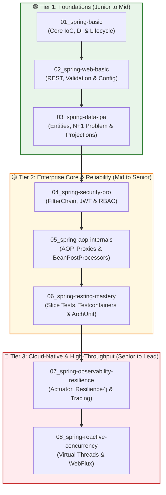

# 🌱 Spring Boot Mastery: Zero to Tech Lead

Welcome to the **Spring Boot Mastery** learning repository. This repository is structured as an end-to-end, project-based curriculum designed to take a developer from core Spring Framework foundations to senior, production-ready, cloud-native architecture using **Spring Boot 3.2+** and **Java 17 / 21**.

All modules are numbered (`01_` through `08_`) in the strict order they should be studied. Each module is an isolated, runnable project complete with its own dedicated [README.md](file:///C:/Amit/code/springBootTutorials/01_spring-basic/README.md), [scope.md](file:///C:/Amit/code/springBootTutorials/01_spring-basic/scope.md), and [Q&A.md](file:///C:/Amit/code/springBootTutorials/01_spring-basic/Q&A.md).

---

## 🗺️ Master Curriculum Roadmap



---

## 📚 Module Catalog & Study Sequence

| # | Module Folder | Level | Key Concepts Covered | Documentation Links |
| :---: | :--- | :---: | :--- | :--- |
| **01** | [`01_spring-basic`](./01_spring-basic) | 🟢 Junior-Mid | Tight vs Loose Coupling, IoC Container, DI types, Bean Lifecycle (`@PostConstruct`, `@PreDestroy`), Scopes (Singleton/Prototype), Component Scanning, Java Config. | [README](./01_spring-basic/README.md) • [Scope](./01_spring-basic/scope.md) • [Q&A](./01_spring-basic/Q&A.md) |
| **02** | [`02_spring-web-basic`](./02_spring-web-basic) | 🟢 Junior-Mid | `@RestController`, Request Mapping, JSR-380 Validation (`@Valid`), Global Error Handling (`@RestControllerAdvice`), YAML Profiles, Type-Safe Config (`@ConfigurationProperties`). | [README](./02_spring-web-basic/README.md) • [Scope](./02_spring-web-basic/scope.md) • [Q&A](./02_spring-web-basic/Q&A.md) |
| **03** | [`03_spring-data-jpa`](./03_spring-data-jpa) | 🟢 Junior-Mid | ORM Entity Mapping, Relationships (1:1, 1:N), Spring Data Repositories, **N+1 Problem** resolution (`JOIN FETCH`), Interface Projections, H2 Database Console. | [README](./03_spring-data-jpa/README.md) • [Scope](./03_spring-data-jpa/scope.md) • [Q&A](./03_spring-data-jpa/Q&A.md) |
| **04** | [`04_spring-security-pro`](./04_spring-security-pro) | 🟡 Mid-Senior | `SecurityFilterChain`, BCrypt Password Encoding, Database Authentication (`UserDetailsService`), Stateless JWT Auth (`JwtAuthenticationFilter`), RBAC & Method Security (`@PreAuthorize`). | [README](./04_spring-security-pro/README.md) • [Scope](./04_spring-security-pro/scope.md) • [Q&A](./04_spring-security-pro/Q&A.md) |
| **05** | [`05_spring-aop-internals`](./05_spring-aop-internals) | 🟡 Mid-Senior | Aspects & Pointcuts, `@Around` custom annotations (`@LogExecutionTime`), JDK Dynamic Proxies vs CGLIB, `BeanPostProcessor` hooks, `HandlerInterceptor`, Asynchronous methods (`@Async`). | [README](./05_spring-aop-internals/README.md) • [Scope](./05_spring-aop-internals/scope.md) • [Q&A](./05_spring-aop-internals/Q&A.md) |
| **06** | [`06_spring-testing-mastery`](./06_spring-testing-mastery) | 🟡 Mid-Senior | Slice Testing (`@WebMvcTest`, `@DataJpaTest`), Real Infrastructure with **Testcontainers** (Dockerized PostgreSQL), Spring Boot 3.1+ `@ServiceConnection`, Architecture Enforcement with **ArchUnit**. | [README](./06_spring-testing-mastery/README.md) • [Scope](./06_spring-testing-mastery/scope.md) • [Q&A](./06_spring-testing-mastery/Q&A.md) |
| **07** | [`07_spring-observability-resilience`](./07_spring-observability-resilience) | 🔴 Senior-Lead | Spring Boot Actuator (`/health`, `/metrics`), custom `HealthIndicator`, **Resilience4j** Circuit Breakers and Retries with fallbacks, Micrometer Tracing foundation. | [README](./07_spring-observability-resilience/README.md) • [Scope](./07_spring-observability-resilience/scope.md) • [Q&A](./07_spring-observability-resilience/Q&A.md) |
| **08** | [`08_spring-reactive-concurrency`](./08_spring-reactive-concurrency) | 🔴 Senior-Lead | **Virtual Threads** (Java 21 Project Loom), Non-blocking Reactive APIs with **Spring WebFlux** (`Mono`, `Flux`), Netty event-loop, Reactive Redis caching abstractions. | [README](./08_spring-reactive-concurrency/README.md) • [Scope](./08_spring-reactive-concurrency/scope.md) • [Q&A](./08_spring-reactive-concurrency/Q&A.md) |

---

## 🛠️ Prerequisites & Environment Setup

- **Java JDK:** 
  - Java 17+ is required for modules `01` through `07`.
  - Java 21+ is required for module `08` (Virtual Threads) and module `02`.
- **Build Tool:** Apache Maven 3.8+ (or Maven wrapper).
- **Docker / Docker Desktop:** Required for running module `06_spring-testing-mastery` (Testcontainers spins up PostgreSQL in a container).
- **Recommended IDE:** IntelliJ IDEA (Community or Ultimate) or Visual Studio Code with the Java Extension Pack.

---

## 🚀 How to Run & Verify Projects

Each module is an independent Maven project located in its own folder.

### Running Module 01 Concept Runners
`01_spring-basic` contains isolated concept packages, each with its own executable runner:
```bash
cd 01_spring-basic
mvn spring-boot:run -Dspring-boot.run.main-class=com.saha.amit.spring_Basic.B_dependencyInjection.DIRunner
```
*(Other runners: `CouplingRunner`, `LifecycleRunner`, `StereotypeRunner`, `ConfigRunner`, `AopRunner`)*

### Running Web Application Modules (02, 03, 04, 05, 07, 08)
To run any of the web-based Spring Boot applications:
```bash
cd 02_spring-web-basic
mvn spring-boot:run
```
Then interact with the endpoints via browser or `curl` (detailed sample requests are provided in each module's `README.md`).

### Running Integration & Architecture Tests (06)
Ensure Docker is running, then execute:
```bash
cd 06_spring-testing-mastery
mvn test
```
This automatically boots a PostgreSQL container via Testcontainers, runs the slice tests, and verifies ArchUnit architectural layering rules.

---

## 📖 Deep-Dive Reference Guides

For additional architectural syllabi, scope definitions, and interview preparations, refer to the documents in [`info/`](./info):

- **[Project Plan](./info/plan.md):** High-level learning roadmap and level breakdown.
- **[Architectural Gaps & Enhancements](./info/enhancements.md):** Analysis of missing enterprise topics, DX tooling, and future roadmap.
- **[Senior Learning Syllabus](./info/ProjectBasedSyllabus.md):** Deep-dive syllabus bridging developer skills to Tech Lead architecture.
- **[Core Basics Overview](./info/Basics.md):** Core Spring principles, stereotypes, and DI deep dive.
- **[Curriculum Scopes](./info/scope):**
  - [Basics Scope](./info/scope/1-Basics.md)
  - [Intermediate Scope](./info/scope/2-Intermediate.md)
  - [Advanced Scope](./info/scope/3-Advanced.md)
  - [Beyond Spring Boot](./info/scope/4-BeyondSpringBoot.md)
- **[Interview Q&A Bank](./info/sample):**
  - [Spring Boot Questions](./info/sample/SringBoot.md)
  - [Detailed Q&A](./info/sample/SringbootQ&A.md)
  - [Deep Architecture Questions](./info/sample/DeepQuestions.md)

---

## 💡 Tech Lead Rapid-Fire Checklist

1. **Inversion of Control (IoC):** How does the container manage dependencies, and why is Constructor Injection superior to Field Injection?
2. **Circular Dependencies:** Why did Spring Boot 2.6+ disable circular dependencies by default, and how can `@Lazy` resolve edge cases?
3. **Dynamic Proxies vs. CGLIB:** When does Spring choose JDK Dynamic Proxies (interface-based) over CGLIB (subclassing bytecode enhancement)?
4. **N+1 Problem:** Why does lazy fetching cause multiple database queries, and how does `JOIN FETCH` prevent performance degradation?
5. **Stateless Security:** Why is `SessionCreationPolicy.STATELESS` preferred in distributed microservices over server-side session state?
6. **Slice Testing vs. Integration Testing:** How do `@WebMvcTest` and `@DataJpaTest` reduce test suite execution time compared to `@SpringBootTest`?
7. **Virtual Threads vs. WebFlux:** When should you choose Java 21 Virtual Threads (thread-per-request model) versus Spring WebFlux (event-loop model)?
