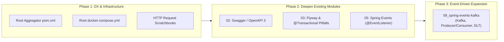

# 🚀 Spring Boot Mastery: Architectural Gaps & Enhancement Roadmap

This document outlines high-value technical topics, architectural patterns, and developer experience (DX) tooling to transition this repository from an educational tutorial series into an **enterprise-grade, production-ready curriculum and portfolio**.

---

## 1. 🏗️ Developer Experience & Tooling Gaps

| Enhancement | Current State | Target State | Impact |
| :--- | :--- | :--- | :--- |
| **Root Aggregator `pom.xml`** | Each of the 8 modules is completely decoupled with its own `pom.xml`. Building or testing requires navigating into each folder individually. | Add a root aggregator POM with a `<modules>` declaration that references `01_spring-basic` through `08_spring-reactive-concurrency`. | Enables single-command operations (`mvn clean compile`, `mvn test`) across the entire repository from the workspace root, while preserving independent module runnability. |
| **Maven Wrapper (`mvnw` / `mvnw.cmd`)** | No wrapper scripts exist; execution depends on having Maven pre-installed and configured on the system's `PATH`. | Include standard Maven wrapper artifacts (`mvnw`, `mvnw.cmd`, `.mvn/wrapper/`). | Guarantees reproducible, zero-setup builds for any developer or CI/CD environment without needing global Maven installation. |
| **Root `docker-compose.yml`** | Modules `06` (PostgreSQL), `07` (Zipkin/Prometheus), and `08` (Redis) require external backing services with no central orchestration. | A centralized `docker-compose.yml` in the root configuring PostgreSQL, Redis, Zipkin, and Prometheus. | Allows developers to boot all local infrastructure dependencies with a single command: `docker compose up -d`. |
| **HTTP Client Scratchbooks (`requests.http`)** | Endpoints must be tested by manually copying and executing `curl` commands or entering URLs into a browser. | Add a `requests.http` file to each web-based module (`02`, `03`, `04`, `05`, `07`, `08`). | Provides one-click endpoint execution and response inspection directly within IntelliJ IDEA and VS Code (REST Client). |

---

## 2. 🧩 Core Curriculum & Technical Architecture Gaps

### A. Event-Driven Architecture & Messaging (Kafka / RabbitMQ / Spring Events)
- **The Gap:** Mentioned in curriculum outlines, but none of the 8 modules implement asynchronous messaging or event brokers.
- **Why It Matters:** Modern enterprise architectures rely heavily on decoupled, asynchronous event publication for scalability, resilience, and eventual consistency.
- **Implementation Strategy:**
  1. **In-Process Events (Module 05):** Add Spring core event mechanisms: `ApplicationEventPublisher`, `@EventListener`, and `@TransactionalEventListener` (ensuring events only fire after database transactions successfully commit).
  2. **Distributed Messaging (Module 09 Expansion):** Create a dedicated `09_spring-events-kafka` module demonstrating:
     - Kafka Producer and Consumer using `spring-kafka`.
     - JSON serialization and deserialization with ErrorHandlingDeserializer.
     - Consumer groups, offset management, and Dead Letter Topics (DLT).
     - Testcontainers Kafka integration for integration testing.

---

### B. Database Schema Migrations (Flyway or Liquibase)
- **The Gap:** `03_spring-data-jpa` currently relies on `spring.jpa.hibernate.ddl-auto: update` with in-memory H2.
- **Why It Matters:** In production enterprise environments, automatic schema generation (`ddl-auto: update` or `create-drop`) is strictly forbidden due to risk of data loss and lack of auditability. Schema evolution must be versioned, immutable, and repeatable.
- **Implementation Strategy:**
  - Add `flyway-core` to `03_spring-data-jpa`.
  - Disable Hibernate DDL auto-generation (`spring.jpa.hibernate.ddl-auto: validate`).
  - Add versioned SQL migration scripts under `src/main/resources/db/migration/`:
    - `V1__create_initial_schema.sql` (Tables and constraints)
    - `V2__insert_seed_data.sql` (Reference test records)
    - `V3__add_indexes.sql` (Performance tuning)

---

### C. `@Transactional` Pitfalls & Proxy Bypass Mechanics
- **The Gap:** The repository demonstrates JPA mappings and queries, but does not explore the runtime mechanics, failure modes, and boundaries of Spring's `@Transactional`.
- **Why It Matters:** Transaction mismanagement causes subtle data corruption, locks, and missed rollbacks. This is among the most frequent senior engineering interview subjects.
- **Key Concepts to Showcase:**
  - **Self-Invocation (Proxy Bypass):** Calling a `@Transactional` method from another method within the same class bypasses the Spring CGLIB proxy, resulting in no active transaction.
  - **Exception Rollback Rules:** By default, Spring only rolls back on unchecked exceptions (`RuntimeException` and `Error`). Checked exceptions do not trigger rollbacks unless explicitly declared with `@Transactional(rollbackFor = Exception.class)`.
  - **Propagation Behaviors:** Practical difference between `REQUIRED` (joins existing transaction) and `REQUIRES_NEW` (suspends current transaction and opens an isolated boundary).
  - **Isolation Levels & Read Phenomena:** Dirty reads, non-repeatable reads, and phantom reads.

---

### D. Interactive API Documentation (OpenAPI 3 / Swagger)
- **The Gap:** `02_spring-web-basic` exposes REST endpoints, but lacks automated contract generation and interactive API testing.
- **Why It Matters:** Industry-standard REST services provide machine-readable contracts and self-documenting interfaces for frontend teams and external consumers.
- **Implementation Strategy:**
  - Add `springdoc-openapi-starter-webmvc-ui` dependency to `02_spring-web-basic`.
  - Annotate controllers and DTOs with `@Operation`, `@ApiResponse`, and `@Schema`.
  - Expose interactive Swagger UI at `http://localhost:8080/swagger-ui.html`.

---

### E. Declarative Multi-Level Caching (`@Cacheable`, Caffeine, Redis)
- **The Gap:** `08_spring-reactive-concurrency` touches reactive Redis, but standard Spring Cache abstraction is omitted.
- **Why It Matters:** Caching is a primary performance optimization strategy for read-heavy enterprise workloads.
- **Key Concepts to Showcase:**
  - Enabling caching with `@EnableCaching`.
  - Declarative annotations: `@Cacheable`, `@CachePut`, `@CacheEvict`, `@Caching`.
  - Multi-level caching architecture: L1 local in-memory cache (Caffeine) paired with L2 distributed shared cache (Redis).
  - Cache stampede prevention and TTL (Time-To-Live) eviction policies.

---

### F. Production Containerization & Cloud-Native Packaging
- **The Gap:** No Docker build definitions exist for containerizing the applications.
- **Why It Matters:** Modern deployment pipelines require containerization. Tech leads must understand Spring Boot 3 Layered JARs to minimize image build time and storage overhead.
- **Implementation Strategy:**
  - Multi-stage `Dockerfile` extracting JAR layers:
    - `dependencies`
    - `spring-boot-loader`
    - `snapshot-dependencies`
    - `application`
  - Demonstration of Cloud-Native Buildpacks (`mvn spring-boot:build-image`).
  - Actuator Kubernetes Probes: configuring `/actuator/health/liveness` and `/actuator/health/readiness`.
  - Graceful Shutdown configuration (`server.shutdown: graceful`).

---

## 3. 🎯 Implementation Roadmap

### Suggested Execution Priority:
1. **Immediate Wins:** Create root `pom.xml`, `docker-compose.yml`, and `requests.http` files.
2. **Persistence Upgrade:** Integrate Flyway migrations and transactional pitfall examples into `03_spring-data-jpa`.
3. **API Upgrade:** Add Swagger UI to `02_spring-web-basic`.
4. **Architecture Expansion:** Scaffold `09_spring-events-kafka` as the capstone distributed systems module.
